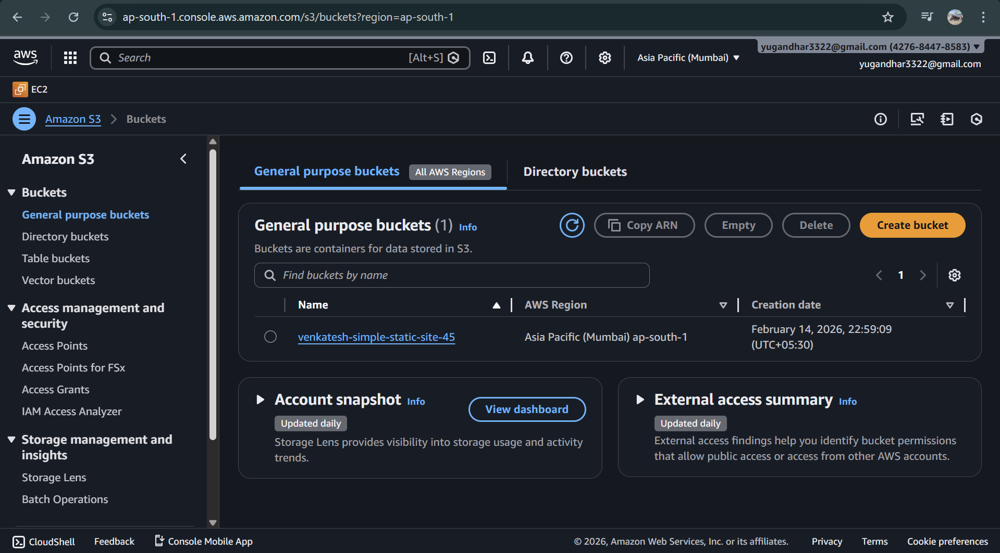
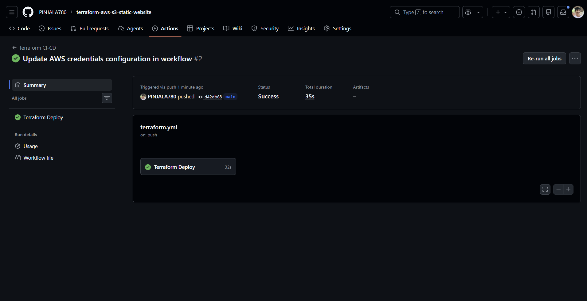
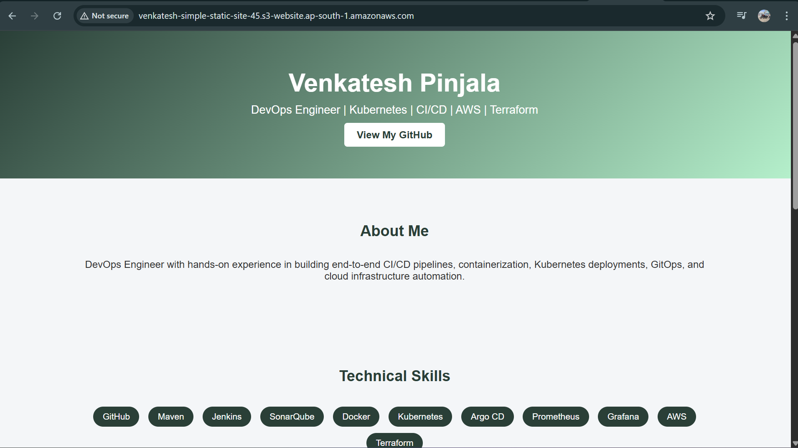

# 🌐 Terraform AWS S3 Static Website

This project provisions an AWS S3 bucket configured as a static website using Terraform and automates deployment using GitHub Actions CI/CD.

---

## 📌 Project Overview

This project demonstrates:

- Infrastructure as Code using Terraform
- AWS S3 static website hosting
- Uploading website files to S3
- CI/CD automation with GitHub Actions
- Secure credential management using GitHub Secrets

---

## 🏗️ Architecture

---

## 🛠️ Technologies Used

- Terraform
- AWS S3
- AWS IAM
- GitHub Actions

---

## 🔐 GitHub Secrets

The following secrets are configured:

- AWS_ACCESS_KEY_ID  
- AWS_SECRET_ACCESS_KEY  

---

## 🚀 Deployment Process

On every push to the repository:

1. terraform init  
2. terraform plan  
3. terraform apply  

GitHub Actions automatically deploys the infrastructure.

---

## 🪣 S3 Bucket

---

## 📄 Website Files

---

## ⚡ CI/CD Success

---

## 🌍 Website Output

---

---

## 🎯 Skills Demonstrated

- Infrastructure as Code (IaC)
- AWS Cloud Services
- CI/CD Automation
- DevOps Best Practices

---

## 👤 Author

Venkatesh pinjala

